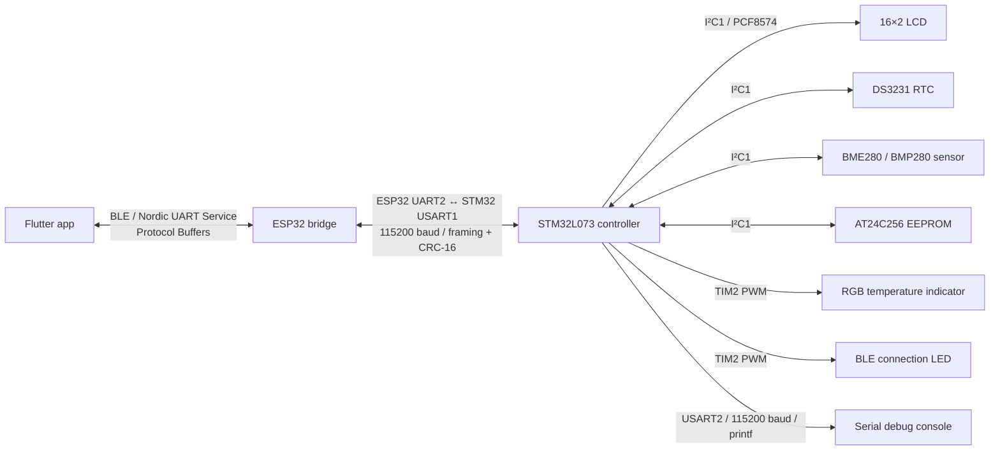

# ClimateClock

ClimateClock is a connected environmental clock and threshold controller built
from an STM32 controller, an ESP32 Bluetooth bridge, and a cross-platform
Flutter application.

The device displays the current UTC date, time, temperature, and, when available,
humidity on a 16×2 LCD.
The mobile application can configure temperature and humidity limits, switch
between Celsius and Fahrenheit, synchronize the real-time clock, receive live
telemetry, and show local notifications when the temperature or humidity
leaves its configured range.

## System architecture



Commands travel from the Flutter app to the ESP32 over Bluetooth Low Energy.
The ESP32 adds stream framing and forwards them to the STM32 over UART. The
STM32 sends temperature and humidity telemetry in the opposite direction,
allowing the app to update its UI and environmental alerts.

## What this project uses

### Embedded controller

- **NUCLEO-L073RZ** development board with an **STM32L073RZ** MCU
- **C11 and C++17** application and driver code
- **STM32CubeIDE**, **STM32CubeMX**, and the **STM32 HAL**
- Interrupt-driven UART reception with a single-producer/single-consumer ring
  buffer
- USART1 for framed ESP32 communication and USART2 for serial debug logs
- PWM outputs for the RGB temperature indicator and BLE connection animation
- Host-side C and C++ tests built with GCC and
  [ThrowTheSwitch Unity](https://github.com/ThrowTheSwitch/Unity), using
  `-Wall -Wextra -Werror`

### Hardware peripherals

- **DS3231** real-time clock for UTC date and time
- **BME280 / BMP280** environmental sensor as the temperature source, with
  pressure support and humidity support when a BME280 is fitted
- **LCD1602 / HD44780-compatible 16×2 display** through a PCF8574 I²C backpack
- **AT24C256 EEPROM** for persistent temperature limits, humidity limits, and
  the selected temperature unit
- **HW-479 RGB LED module** for below-range and above-range indication
- A separate PWM-driven LED for BLE connection state

### Wireless bridge

- **ESP32** using the Arduino framework
- Bluetooth Low Energy with the **Nordic UART Service** UUIDs
- ESP32 UART2 on GPIO 16/17 at 115200 baud
- Bidirectional forwarding of commands, telemetry, and BLE connection state

### Mobile application

- **Flutter** and **Dart**
- Cross-platform project targets for Android, Windows, and web
- **flutter_blue_plus** for BLE discovery, connection, writes, and
  notifications
- **permission_handler** for platform-specific Bluetooth permissions, including
  Android runtime permissions
- **flutter_local_notifications** for temperature and humidity threshold alerts
- **protobuf** and **fixnum** for generated protocol messages and 64-bit values
- Material UI with live temperature and humidity, limit controls,
  Celsius/Fahrenheit selection, and RTC synchronization

### Data and tooling

- **Protocol Buffers v3** as the shared command and telemetry schema
- **nanopb** for small, allocation-free protobuf messages on STM32 and ESP32
- A portable C UART framing layer with length, magic bytes, and
  **CRC-16/CCITT-FALSE**
- Python generation scripts for nanopb and Dart bindings
- **just** for common formatting, generation, Android setup, and APK tasks
- **clang-format** for custom C/C++ sources
- **GitHub Actions** for Flutter analysis and tests plus host-side C/C++ tests

## Main features

- Displays UTC time, date, temperature, and available humidity without clearing
  the LCD on each update, avoiding visible flicker
- Configurable minimum and maximum temperature and humidity limits
- Persistent limits and temperature unit with safe defaults when EEPROM is
  unavailable
- Celsius and Fahrenheit display modes while storing protocol values in tenths
  of a degree Celsius
- Device-authoritative settings synchronization: the app adopts the unit stored
  by the STM32 when it connects and sends changes only after an explicit user
  selection
- Blue indication below the minimum, red indication at or above the maximum
- Live BLE telemetry and local notifications when temperature or humidity
  crosses a limit
- BLE connecting/disconnecting animation and steady connected indication
- Framed UART protocol that can recover from noise, incomplete messages, and
  corrupted payloads

## Repository layout

| Path | Purpose |
| --- | --- |
| [`stm32/`](stm32/) | STM32CubeIDE project, application code, hardware drivers, generated nanopb bindings, and host tests |
| [`esp32_bridge/`](esp32_bridge/) | ESP32 Arduino BLE-to-UART bridge and its generated nanopb runtime |
| [`app/`](app/) | Cross-platform Flutter application and generated Dart protobuf bindings |
| [`protocol/`](protocol/) | Canonical `device.proto` schema and generation scripts |
| [`shared/uart_framing/`](shared/uart_framing/) | Portable UART framing and CRC implementation shared by both firmwares |
| [`third_party/nanopb/`](third_party/nanopb/) | nanopb Git submodule |
| [`third_party/unity/`](third_party/unity/) | ThrowTheSwitch Unity test framework Git submodule |
| [`.github/workflows/ci.yml`](.github/workflows/ci.yml) | Flutter and host C/C++ continuous integration |
| [`justfile`](justfile) | Repository development commands |

## Communication protocol

[`protocol/device.proto`](protocol/device.proto) defines a `DeviceMessage`
envelope containing:

- Commands to set temperature and humidity limits, current time, and display
  unit
- Live measurement telemetry containing temperature and optional humidity
- Device settings telemetry containing persisted limits and the selected
  temperature unit
- ESP32 bridge connection-state reports

Measurement and settings telemetry are separate so each message fits within the
default BLE notification payload. When notifications become ready, the STM32
sends its settings first; the Flutter app adopts them instead of overwriting the
stored unit with its local default.

BLE carries serialized protobuf messages directly. UART is a byte stream, so
the ESP32 and STM32 wrap each protobuf payload in:

```text
A5 5A | uint16 payload length | protobuf payload | CRC-16
```

See [`protocol/UART_FRAMING.md`](protocol/UART_FRAMING.md) for the byte-level
format.

## Getting started

Initialize the nanopb submodule after cloning:

```sh
git submodule update --init --recursive
```

### Generate protocol bindings

Install the Python dependencies and Dart protobuf generator:

```sh
python -m pip install protobuf grpcio-tools
dart pub global activate protoc_plugin
```

Regenerate the STM32 and Flutter bindings:

```sh
just protobuf
```

### Build and flash the STM32

Import [`stm32/`](stm32/) as an existing STM32CubeIDE project, build it, and
flash the NUCLEO-L073RZ. The CubeMX hardware configuration is stored in
[`stm32/temp.ioc`](stm32/temp.ioc).

The main connections configured by the project are:

| STM32 interface | Pins | Purpose |
| --- | --- | --- |
| I2C1 | PB6 SCL, PB9 SDA | LCD1602, DS3231, AT24C256, and BME280/BMP280 |
| USART1 | PA9 TX, PA10 RX | Framed communication with the ESP32 |
| USART2 | PA2 TX, PA3 RX | Debug `printf` output |
| TIM2 PWM | PA0, PA1, PB10, PB11 | RGB indicator and BLE connection LED |

### Build and flash the ESP32

Open
[`esp32_bridge/bridge_uart/bridge_uart.ino`](esp32_bridge/bridge_uart/bridge_uart.ino)
in an ESP32-compatible Arduino environment and flash the board. Connect ESP32
UART2 with crossed TX/RX lines and a common ground:

- ESP32 TX GPIO 17 → STM32 USART1 RX PA10
- ESP32 RX GPIO 16 ← STM32 USART1 TX PA9

The bridge advertises as `ClimateClock`.

### Run the Flutter app

Select a supported Flutter target with Bluetooth available, then run:

```sh
cd app
flutter pub get
flutter run
```

For Android specifically, build a release APK from the repository root with:

```sh
just apk
```

## Tests and formatting

Configure, build, and run the STM32 host test suite:

```sh
cmake -S stm32/Tests -B stm32/Tests/.build/cmake -G Ninja \
  -DCMAKE_C_COMPILER=gcc -DCMAKE_CXX_COMPILER=g++
cmake --build stm32/Tests/.build/cmake
ctest --test-dir stm32/Tests/.build/cmake --output-on-failure
```

The suite tests UART framing and recovery, protobuf decoding, the receive ring
buffer, BMX280 measurement and compensation, EEPROM settings, telemetry,
byte and temperature utilities, HAL UART adaptation, screen formatting, and
flicker-free LCD row updates.

Analyze and test the Flutter application:

```sh
cd app
flutter analyze
flutter test
```

GitHub Actions runs both the Flutter checks and the host C/C++ suite for pushes
and pull requests.

Format the repository-owned embedded sources:

```sh
just format
```

More component-specific notes are available in
[`stm32/README.md`](stm32/README.md),
[`app/README.md`](app/README.md), and
[`shared/uart_framing/README.md`](shared/uart_framing/README.md).
